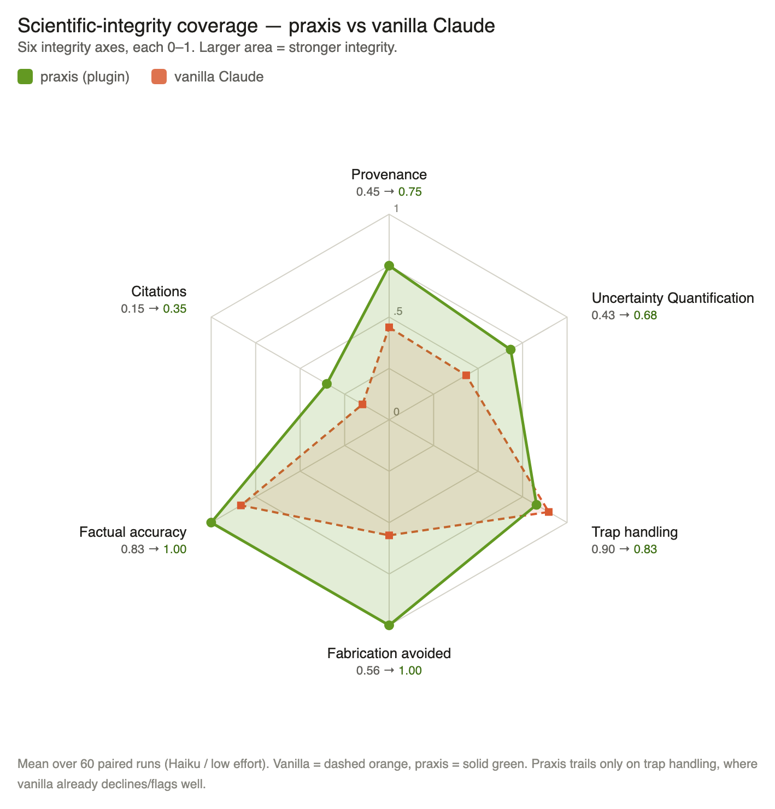

# Evaluation — does praxis actually help?

A controlled comparison of Claude **without** the praxis plugin (*vanilla*) vs. **with** it
(*praxis*), on identical scientific questions, scored on **scientific integrity** rather than
generic helpfulness. The two arms differ in only one variable: the plugin.

*24 questions × Haiku × low effort — 60 paired runs, pooled across two machines. Larger area = stronger integrity.*

---

## The metrics

### Objective (pattern / retrieval, no LLM)
- **Provenance** — fraction of answers that attribute claims to a real source.
- **Citations** — fraction with ≥1 checkable reference (arXiv / DOI / URL).
- **Factual accuracy** — does the number match the retrieved gold value within its uncertainty
  (only on verified keys).
- **Fabrication avoided** — `1 − risk` of stating an unsourced number on a factual question.

### Semantic classifier (cheap, blind, per answer)
- **Uncertainty quantification** — did it carry intervals / error bars?
- **Trap handling** — on traps, did it reject false premises / decline the unanswerable /
  flag contested topics?

### Blind judge (Opus, scores each answer 0–2)
- **Provenance, Uncertainty, Trap handling, Correctness** — holistic quality,
  blinded + order-randomized.

**Combining:** the hexagon shows the **absolute mean per arm**; the forest plot shows the
**paired praxis − vanilla** difference with a **95% bootstrap CI** — a result counts as a win
**only when the CI clears zero**.

---

## Results

Objective metrics over **60 paired runs** (24 questions, Haiku / low effort), paired
praxis − vanilla with 95% bootstrap CI:

| Result | Metrics | Status |
|---|---|---|
| **Significant** (95% CI excludes 0) | provenance (+0.30), uncertainty (+0.25), citations (+0.52), fabrication avoided (risk 0.44 → 0.00) | praxis better |
| **Leaning praxis** (CI touches 0) | factual accuracy (0.83 → 1.00) | promising |
| **Honest null** | trap handling (−0.07) | wash — vanilla already declines/flags well at this tier |

**Read honestly:** the measurable praxis advantage is **provenance, uncertainty, citations,
and fabrication-avoidance** — not trap handling, which vanilla already does at this tier.
Factual keys are **retrieved from GWOSC**, never recalled, so factual-accuracy is graded
against real catalog values (new questions with `needs_retrieval` keys are excluded from that
axis until verified).

*Blind judge (pilot, 24 paired runs) preferred praxis 17 / 24 (vanilla 4, tie 3); not yet
re-run on the expanded 60-run set.*

---

## Reproduce / extend

The harness and question set live in the sibling `praxis-test/eval/` setup; the figure is
regenerated from scored results with `make_hexagon.py`. See `HEXAGON_VIZ.md` for the recipe to
pool results across machines (add questions → recompute the six axis means → the chart updates).
